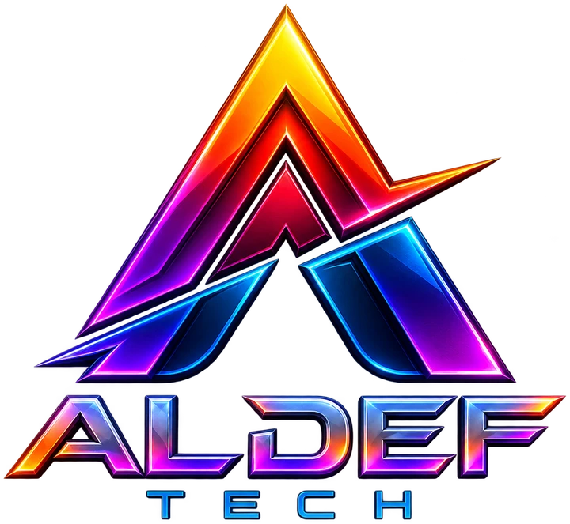

  

<h1 align="center">Padel Replay</h1>

  <strong>Rekam, Putar Ulang, dan Bagikan Momen Terbaik di Lapangan Padel.</strong>

  
  
  
  
  
  

## Tentang Aldef Tech

**Aldef Tech** adalah mitra transformasi digital yang membantu bisnis merancang, membangun, dan mengembangkan teknologi sesuai kebutuhan operasionalnya. Kami menggabungkan pemahaman proses bisnis dengan software engineering untuk menghasilkan solusi yang efektif, scalable, aman, dan mudah dikembangkan dalam jangka panjang.

Mulai dari validasi kebutuhan hingga deployment dan dukungan pascapeluncuran, setiap solusi dirancang untuk menyederhanakan pekerjaan, menghubungkan data, mengurangi proses manual, dan membantu perusahaan mengambil keputusan dengan lebih cepat.

### Fokus layanan

- **Custom Software Engineering** — sistem bisnis yang mengikuti alur kerja dan kebutuhan unik perusahaan.
- **Web Application & SaaS Development** — aplikasi web modern dan platform multi-tenant yang siap berkembang.
- **AI Solutions & Intelligent Automation** — integrasi AI, knowledge base, AI agent, dan otomasi proses bisnis.
- **Business Process Automation** — digitalisasi workflow, approval, pelaporan, dan pekerjaan berulang.
- **System Integration & Enterprise API** — integrasi ERP, payment gateway, WhatsApp, sistem legacy, dan layanan pihak ketiga.
- **Modernization & Performance Tuning** — refactoring aplikasi lama, peningkatan performa, keamanan, dan kesiapan skala.

## Tentang Repositori

Repositori ini berisi source code **Padel Replay**, sistem kamera dan replay instan untuk klub padel. Kamera di setiap lapangan merekam terus-menerus; saat terjadi poin terbaik, pemain cukup menekan tombol **REPLAY** dan 30 detik terakhir langsung menjadi klip video yang bisa diputar di layar TV klub, ditonton ulang, dan diunduh.

Alur singkatnya:

1. Kamera IP di lapangan mengirim stream (RTMP/SRT, H.264) ke media server dan direkam sebagai buffer 2 jam.
2. Admin klub memulai sesi; pemain bergabung dengan memindai QR di lapangan.
3. Pemain menekan REPLAY; sistem memotong rekaman menjadi klip dan mengabarkan statusnya secara realtime.
4. Klip siap tampil otomatis di layar TV klub dan tersimpan di pustaka replay.

Fitur utamanya meliputi:

- dashboard klub: status lapangan, kamera online, sesi aktif, dan replay terbaru;
- live view setiap kamera lewat WebRTC/HLS, status perekaman, dan URL publish kamera;
- sesi lapangan dengan QR join, permintaan replay, dan notifikasi realtime (Socket.IO);
- pustaka replay dengan statistik penyimpanan, filter lapangan/status/tanggal, putar, unduh, dan hapus klip;
- layar TV mode kiosk yang memutar klip terbaru secara otomatis lengkap dengan logo klub;
- tournament manager: sistem gugur, setengah kompetisi, grup + gugur, undian, jadwal, input skor sesuai aturan padel, klasemen, bagan, dan halaman publik;
- manajemen klub, lapangan, kamera, pemain, dan pengguna dengan role super admin, admin klub, dan pemain;
- login admin dengan username/email, login pemain dengan kode verifikasi email, profil dan foto profil;
- tampilan bilingual Bahasa Indonesia dan Inggris.

## Coba Demo

Jelajahi semua fitur di **[demo.padel.aldeftech.com](https://demo.padel.aldeftech.com)** dengan akun berikut:

| Username | Password | Role |
| --- | --- | --- |
| `demo` | `demo` | Super admin |

Demo berisi tiga klub, kamera live, riwayat sesi dan replay, serta turnamen di berbagai tahap. Data kembali ke kondisi awal setiap hari pukul 00:00 WIB.

## Teknologi

| Area | Teknologi |
| --- | --- |
| Backend | Node.js 22, NestJS 12, TypeScript |
| Frontend | React 19, Vite 8, Tailwind CSS 4, TanStack Query, React Router |
| Database | PostgreSQL 16, Prisma 7 |
| Antrean & realtime | Redis 7, BullMQ, Socket.IO |
| Video | MediaMTX (RTMP, SRT, WebRTC, HLS, perekaman fMP4), FFmpeg |
| Infrastruktur | Docker Compose, nginx, Let's Encrypt, systemd |
| Testing | Vitest, Supertest, Playwright |

## Dokumentasi

- [`apps/api`](apps/api/README.md) — REST API, autentikasi, dan daftar endpoint (Swagger di `/docs`).
- [`apps/web`](apps/web/README.md) — aplikasi web admin, layar TV, dan halaman publik turnamen.
- [`infra`](infra/README.md) — PostgreSQL, Redis, dan MediaMTX dengan Docker Compose.
- [`infra/deploy`](infra/deploy/README.md) — deploy produksi dengan nginx dan systemd.
- [`infra/demo`](infra/demo/README.md) — instance demo dan reset data harian.

## Kustomisasi

  <strong>JIKA BERMINAT UNTUK KUSTOMISASI BISA MENGHUBUNGI DENI AFRIZAL</strong>

  

## Kontak

Punya kebutuhan sistem, aplikasi, SaaS, integrasi, atau otomasi AI? Kunjungi [aldeftech.com/contact](https://aldeftech.com/contact) untuk mendiskusikan kebutuhan bisnis Anda bersama Aldef Tech.

---

  © Aldef Tech. Seluruh hak cipta dilindungi.

